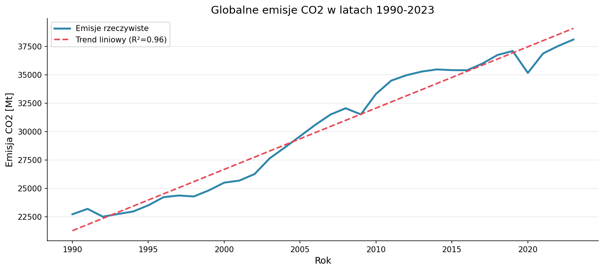
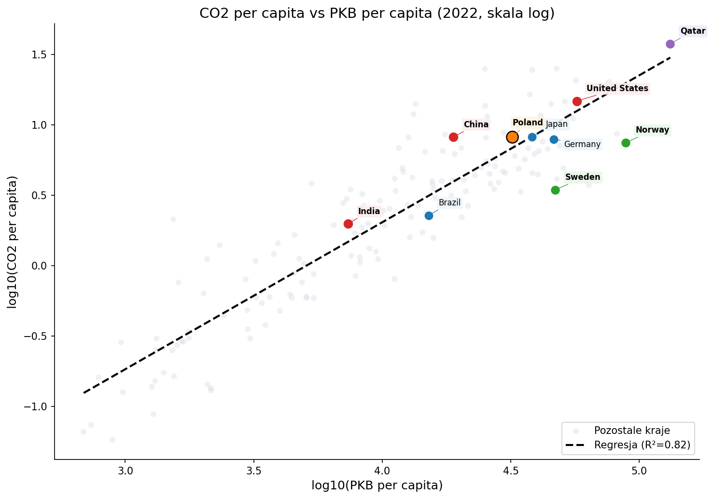
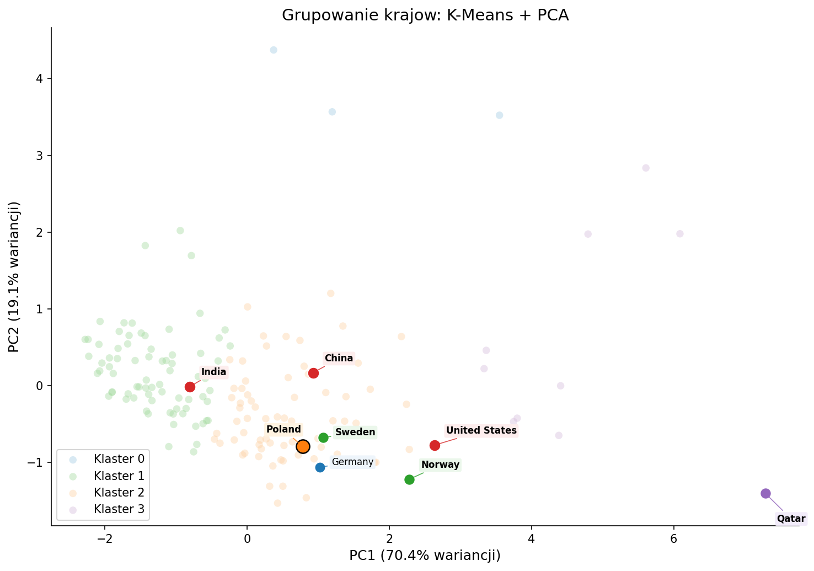

# Analiza emisji CO₂ i zużycia energii na świecie

Projekt zaliczeniowy z przedmiotu:
**Metody analizy, przetwarzania i wizualizacji danych**

Autorzy:  
Jakub Adwentowski / Robert Dzienio  

---

## Cel projektu

Celem projektu była analiza globalnych emisji CO₂ oraz zużycia energii, a także identyfikacja zależności między poziomem rozwoju gospodarczego a emisjami.

---

## Dane

Źródło:  
Our World in Data (owid-co2-data.csv)

- ponad 50 000 rekordów  
- 218 krajów  
- zakres lat: 1750–2024  
- 79 atrybutów  

---

## Technologie

- Python  
- pandas, NumPy  
- matplotlib, seaborn  
- scikit-learn  

---

## Etapy projektu

### 1. Preprocessing
- usunięcie agregatów (np. World, Europe)
- analiza braków danych
- transformacje logarytmiczne
- dyskretyzacja emisji

### 2. Analiza danych
Zastosowane metody:
- regresja liniowa (log-log)
- korelacja Pearsona
- K-Means (k=4)
- PCA (redukcja wymiarów)

### 3. Wizualizacja
- trendy globalne
- top emitenci
- scatter PKB vs emisje
- heatmapa korelacji
- PCA + K-Means
- analiza źródeł emisji

---

## Najważniejsze wnioski

- emisje CO₂ wykazują długoterminowy trend wzrostowy  
- istnieje silna zależność między PKB a emisjami  
- kraje skandynawskie stanowią wyjątek (niższe emisje)  
- możliwa jest segmentacja krajów według profilu energetycznego  

---

## Przykładowe wizualizacje





---

## Dashboard

Dostępna jest również wersja uproszczonego dashboardu:
- plik: `dashboard.html`
-strona https://rdzienio.github.io/merito-co2-analysis-project

---

## Uruchomienie

```bash
uv venv
source .venv/bin/activate
uv pip install -r requirements.txt
python main.py
